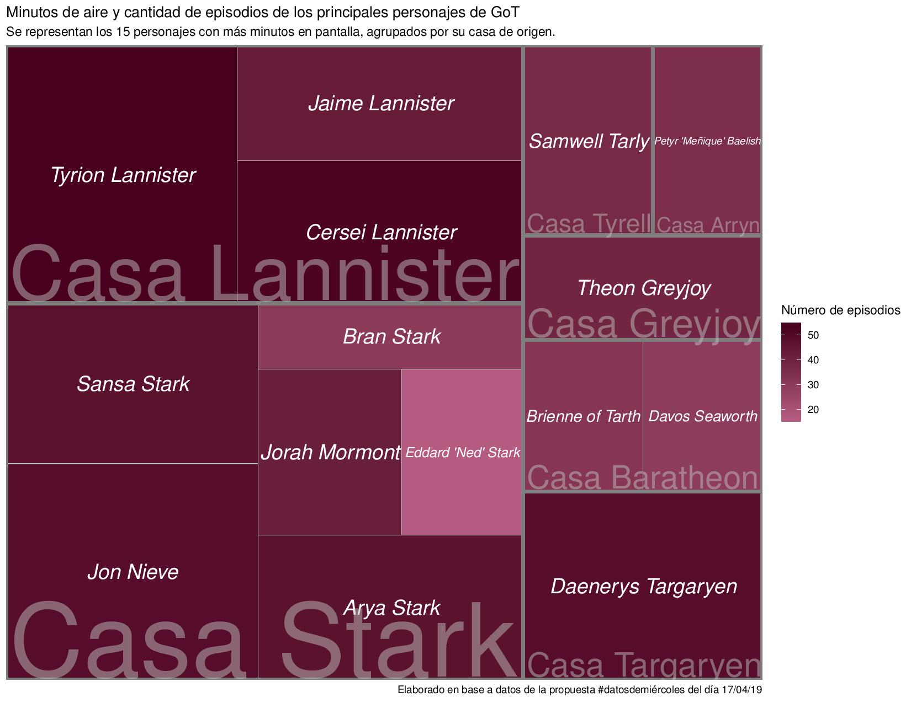

# Datos de miércoles semana 2
*17/04/19*

Sobre 3 datasets de Game of Thrones :tv:
Pueden encontrar más información sobre los datos [aquí](https://github.com/cienciadedatos/datos-de-miercoles/tree/master/datos/2019/2019-04-17)

Realicé un gráfico tipo *treemap* con los personajes de GoT con más minutos en pantalla (indicado por el área del rectángulo que ocupa cada uno) y la cantidad de episodios está señalada por la intensidad del color. Además están agrupados por su casa de origen.

Librerías utilizadas:
- Readr
- Tidyverse
- Treemapify

Cargamos los datos con las siguentes líneas (sólo utilizamos dos de los datasets):
>tiempo_pantalla <- readr::read_csv("https://raw.githubusercontent.com/cienciadedatos/datos-de-miercoles/master/datos/2019/2019-04-17/tiempo_pantalla.csv")

>cambio_lealtades <- readr::read_csv("https://raw.githubusercontent.com/cienciadedatos/datos-de-miercoles/master/datos/2019/2019-04-17/cambio_lealtades.csv")

Filtramos los datos que nos interesan y los cruzamos:
>personajes_mas_minutos<- tiempo_pantalla%>%
  filter(minutos_pantalla>85)

>casas<- cambio_lealtades%>%
  select(nombre, origen)

>pmm_casas<-left_join(personajes_mas_minutos, casas, by="nombre")
Plasmamos en la nube de palabras:

Hacemos el treemap:
>ggplot(pmm_casas, aes(area = minutos_pantalla, fill = episodios, subgroup=origen, label = nombre)) +
  geom_treemap() +
  geom_treemap_subgroup_border()+
  scale_fill_gradient(low = "#B55B81", high= "#48001E")+
  geom_treemap_text(fontface = "italic", colour = "white", place = "centre")+
  geom_treemap_subgroup_text(place = "bottomleft", colour = "grey", alpha = 0.5, grow = T)+
  labs(title = "Minutos de aire y cantidad de episodios de los principales personajes de GoT", subtitle = "Se representan los 15 personajes con más minutos en pantalla, agrupados por su casa de origen.", fill="Número de episodios",
       caption = "Elaborado en base a datos de la propuesta #datosdemiércoles del día 17/04/19")

